<!-- ========================================================= -->
<!--                  VARUN S D — GITHUB PROFILE                -->
<!-- ========================================================= -->

<!-- ========================= HERO ========================== -->

 

  

<b>Building modern web applications, SaaS products & AI-powered experiences.</b>

 

  

 

<!-- ========================= ABOUT ========================= -->

<h2 align="center">
  ⚡ About Me
</h2>

 

<table align="center">
<tr>

<td width="50%" valign="top">

<h3>🧑‍💻 The Developer</h3>

I'm a <strong>Software Developer</strong> focused on designing
and building modern, scalable and user-friendly digital products.

I work across the stack — from polished frontend experiences
to backend services, REST APIs and AI-powered features.

</td>

<td width="50%" valign="top">

<h3>🚀 The Approach</h3>

I enjoy taking features from
<strong>idea → prototype → development → testing → deployment.</strong>

My focus is on creating products that are
<strong>useful, maintainable, responsive and production-ready.</strong>

</td>

</tr>
</table>

  

<!-- ======================= SNAPSHOT ======================== -->

<h2 align="center">
  🧭 Developer Snapshot
</h2>

 

<table>

<tr>

<td align="center" width="25%">

<h2>💻</h2>

<b>Frontend</b>

  

React  
 
Next.js  
 
TypeScript

</td>

<td align="center" width="25%">

<h2>⚙️</h2>

<b>Backend</b>

  

Node.js  
 
REST APIs  
 
Services

</td>

<td align="center" width="25%">

<h2>🤖</h2>

<b>AI</b>

  

OpenAI  
 
Gemini  
 
Claude

</td>

<td align="center" width="25%">

<h2>📱</h2>

<b>Mobile</b>

  

Flutter  
 
Dart  
 
Cross-platform

</td>

</tr>

</table>

  

<!-- ======================== EXPERIENCE ==================== -->

<h2 align="center">
  💼 Experience
</h2>

 

<table align="center">

<tr>

<td width="30%" valign="top">

<h3>🚀 Software Developer</h3>

<h4>SpotNXT</h4>

 

<code>SDE / Software Development</code>

  

<b>Product Development</b>

</td>

<td width="70%" valign="top">

<ul>

<li>
Owned features end-to-end on a fast-moving product team,
from early concept and prototyping through implementation,
testing, deployment and production support.
</li>

 

<li>
Built polished product experiences using
<strong>React, Next.js, TypeScript and JavaScript</strong>.
</li>

 

<li>
Worked with supporting
<strong>Node.js services and REST APIs</strong>.
</li>

 

<li>
Integrated <strong>OpenAI, Gemini and Claude APIs</strong>
to build and improve AI-enabled product capabilities.
</li>

 

<li>
Contributed to product development with a focus on
<strong>usability, performance and production-ready implementation</strong>.
</li>

</ul>

</td>

</tr>

</table>

  

<!-- ====================== TECHNOLOGIES ===================== -->

<h2 align="center">
  ⚡ Technologies I Work With
</h2>

  

<h3>🎨 Frontend</h3>

  

<h3>⚙️ Backend & APIs</h3>

  

<h3>📱 Mobile Development</h3>

  

<h3>🤖 AI & LLM APIs</h3>

 

  

<h3>🧰 Tools</h3>

  

<!-- ===================== HOW I BUILD ====================== -->

<h2 align="center">
  🔄 How I Build Products
</h2>

  

<table>

<tr>

<td align="center" width="16%">

<h3>💡</h3>

<b>DISCOVER</b>

 

Understand the problem

</td>

<td align="center" width="16%">

<h3>🎨</h3>

<b>DESIGN</b>

 

Plan & prototype

</td>

<td align="center" width="16%">

<h3>⚙️</h3>

<b>BUILD</b>

 

Develop the product

</td>

<td align="center" width="16%">

<h3>🤖</h3>

<b>INTEGRATE</b>

 

APIs & AI

</td>

<td align="center" width="16%">

<h3>🧪</h3>

<b>TEST</b>

 

Improve & refine

</td>

<td align="center" width="16%">

<h3>🚀</h3>

<b>SHIP</b>

 

Deploy & support

</td>

</tr>

</table>

  

<!-- ==================== FEATURED PROJECTS ================= -->

<h2 align="center">
  🚀 Featured Projects
</h2>

 

<table align="center">

<tr>

<td width="50%" valign="top">

<h3 align="center">
  🎯 SpotNXT
</h3>

<code>SaaS</code>
&nbsp;
<code>Product Development</code>
&nbsp;
<code>AI</code>

A modern SaaS product focused on helping businesses
build a more predictable customer acquisition and
sales process.

Built product experiences across frontend,
backend services, APIs and AI-enabled capabilities.

</td>

<td width="50%" valign="top">

<h3 align="center">
  🤖 AI Applications
</h3>

<code>LLM APIs</code>
&nbsp;
<code>Automation</code>
&nbsp;
<code>AI</code>

Building applications that integrate modern AI models
to create intelligent workflows, generated content
and AI-assisted product experiences.

Worked with OpenAI, Gemini and Claude APIs
for AI-enabled product functionality.

</td>

</tr>

<tr>

<td width="50%" valign="top">

<h3 align="center">
  🌐 Business Websites
</h3>

<code>Responsive UI</code>
&nbsp;
<code>SEO</code>
&nbsp;
<code>Deployment</code>

Designed and developed responsive websites for
different business requirements with a focus on
modern UI, usability, SEO and deployment.

</td>

<td width="50%" valign="top">

<h3 align="center">
  📱 Cross-Platform Applications
</h3>

<code>Flutter</code>
&nbsp;
<code>Dart</code>
&nbsp;
<code>APIs</code>

Developing cross-platform applications with
modern interfaces and backend/API integrations.

</td>

</tr>

</table>

  

<!-- ===================== CURRENTLY CODING ================== -->

<h2 align="center">
  👨‍💻 Currently Coding
</h2>

  

<!-- =================== DEVELOPMENT PRINCIPLES ============= -->

<h2 align="center">
  💎 Development Principles
</h2>

 

<table align="center">

<tr>

<td align="center" width="25%">

<h2>⚡</h2>

<b>Performance</b>

 

Fast & efficient applications

</td>

<td align="center" width="25%">

<h2>🎨</h2>

<b>Design</b>

 

Clean & intuitive experiences

</td>

<td align="center" width="25%">

<h2>🧩</h2>

<b>Architecture</b>

 

Maintainable & scalable code

</td>

<td align="center" width="25%">

<h2>🚀</h2>

<b>Delivery</b>

 

From idea to production

</td>

</tr>

</table>

  

<!-- ===================== GITHUB ANALYTICS ================= -->

<h2 align="center">
  📊 GitHub Analytics
</h2>

 

  

<!-- ====================== GITHUB STREAK =================== -->

<h2 align="center">
  🔥 Contribution Streak
</h2>

 

  

<!-- ================= CONTRIBUTION GRAPH =================== -->

<h2 align="center">
  📈 Contribution Activity
</h2>

 

  

<!-- ================= CONTRIBUTION SNAKE ==================== -->

<h2 align="center">
  🐍 Contribution Journey
</h2>

 

<picture>

<source media="(prefers-color-scheme: dark)" srcset="https://raw.githubusercontent.com/varunsd16-del/varunsd16-del/output/github-contribution-grid-snake-dark.svg">

<source media="(prefers-color-scheme: light)" srcset="https://raw.githubusercontent.com/varunsd16-del/varunsd16-del/output/github-contribution-grid-snake.svg">

</picture>

  

<!-- ====================== GITHUB FOCUS ===================== -->

<h2 align="center">
  🎯 What I'm Focused On
</h2>

  

<!-- ========================= CONNECT ====================== -->

<h2 align="center">
  🤝 Let's Build Something
</h2>

 

I'm interested in building useful products,
solving interesting problems and exploring new technologies.

 

  

<b>Thanks for visiting my profile 👋</b>

  

  

<!-- ========================== FOOTER ====================== -->

